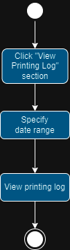
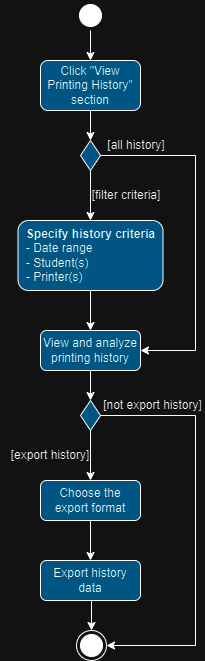
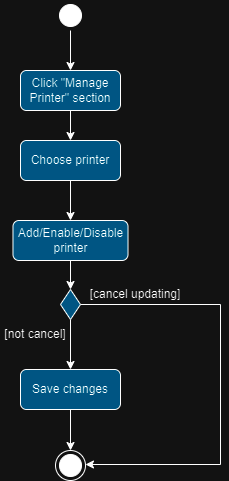
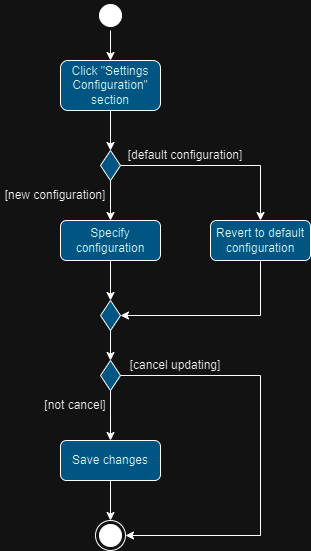
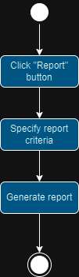
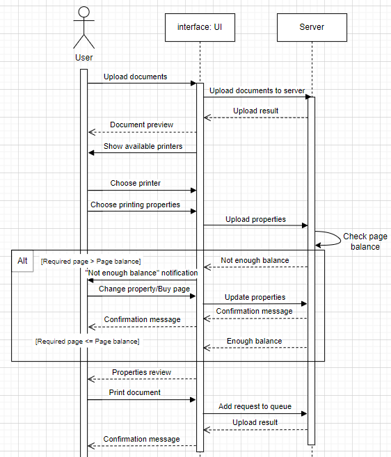

# HCMUT_SSPS - STUDENT SMART PRINTING SERVICE at HCMUT

## Table of Contents

- [HCMUT\_SSPS - STUDENT SMART PRINTING SERVICE at HCMUT](#hcmut_ssps---student-smart-printing-service-at-hcmut)
  - [Table of Contents](#table-of-contents)
  - [Requirements](#requirements)
    - [Domain Context](#domain-context)
    - [FRs and NFRs](#frs-and-nfrs)
    - [Use-case Diagram](#use-case-diagram)
      - [Use case system of HCMUT\_SSPS](#use-case-system-of-hcmut_ssps)
      - [Printing Module off HCMUT\_SSPS](#printing-module-off-hcmut_ssps)
  - [System Modeling](#system-modeling)
    - [Activity Diagrams](#activity-diagrams)
      - [Description](#description)
    - [Sequence Diagrams](#sequence-diagrams)
    - [Class Diagram](#class-diagram)
    - [Figma](#figma)
  - [Architectural Design](#architectural-design)
    - [Architectual Diagram](#architectual-diagram)
      - [Arc. Diagram](#arc-diagram)
      - [Arc. Description](#arc-description)
    - [Component Diagram](#component-diagram)
      - [Comp. Diagram](#comp-diagram)
      - [Comp. Description](#comp-description)
  - [Project Information](#project-information)

## Requirements

### Domain Context

- Domain Context: [Read here](./requirements/domain_context.md)
- Relevant Stakeholders and their current needs: [Read here](./requirements/stakeholders.md)
- Benefits of HCMUT_SPSS for each stakeholders: [Read here](./requirements/benefits.md)

### FRs and NFRs

- Functional Requirements: [See the table here](./requirements/frs.md)
- Non-functional Requirements: [See the table here](./requirements/nfrs.md)

### Use-case Diagram

- Table of use-cases: [See here](./requirements/table_of_usecases.md)
  - Upload Document:
#### Use case system of HCMUT_SSPS

#### Printing Module of HCMUT_SSPS

## System Modeling

### Activity Diagrams

#### (Student) Printing

1. A student uploads the document file to be printed. 
2. If the file type is not among the ones permitted by the SPSO, he/she is required to upload another one until the file type is valid or he/she cancels uploading. 
3. The student then chooses a printer and specifies printing properties (paper size, pages to be printed, one-/double-sided printing, number of copies, etc.). 
4. If the number of pages to be printed exceeds the student’s account page balance, he/she may buy some printing pages, or change the printing properties, or cancel printing.
5. Finally the document printing is conducted.

#### (Student) Viewing Printing Log

1. A student clicks the “View Printing Log” section.
2. He/she then specifies the date range that he/she wants to log.
3. Finally the system shows the printing log for him/her to view.

#### (SPSO) Viewing Printing History

1. SPSO clicks the “View Printing History” section.
2. If SPSO doesn’t want to see all history, he/she specifies the date range, student ID and printer(s) to view history.
3. SPSO views and analyzes printing history.
4. If SPSO wants to export history data, he/she specifies the export format and then exports.

#### (SPSO) Managing Printers

1. SPSO clicks the “Manage Printer” section.
2. SPSO chooses the printer to manage.
3. SPSO adds/enables/disables the chosen printer.
4. If SPSO decides not to update, he/she cancels updating, else he/she saves changes.

#### (SPSO) Managing Configuration

1. SPSO clicks the “Settings Configuration” section.
2. SPSO reverts all configurations to default ones or specifies new configurations.
3. If SPSO decides not to update, he/she cancels updating, else he/she saves changes.

#### (SPSO) Generating Reports

1. SPSO clicks the “Generate Report” button.
2. SPSO specifies the report criteria (time period, type of report).
3. SPSO clicks the “Generate” button to make the system generate the appropriate report.

### Sequence Diagram

For the whole diagram: [See here](https://app.diagrams.net/#G1ip6WyXsUAPqwOgMxc2w9fqgi0lAFVO5v)

#### (User) Printing documents

The SSPS interface facilitates the user's document upload requests, enabling document uploads to the Server. The Server manages these requests and uploads the results back to the UI for the user's review. The UI presents a selection of available printers for the user to choose from, and upon selection, the user can customize printing properties, sending the request to the Server via the UI. The Server processes the properties request, checking the page balance and responding accordingly:

If the required pages exceed the page balance, the Server sends a "Not Enough Balance" response to the UI, prompting the user to either modify properties or purchase more pages, with the UI sending an "Update Properties" request to the Server. The Server handles the request, returning a "Confirmation Message" response to the UI for the user. 

If the required pages are less than or equal to the page balance, the Server returns an "Enough Balance" response, and the UI displays a properties preview, allowing the user to proceed with printing. 

Subsequently, the user can send the "Print Document" request to the Server via the UI, which adds the request to the processing queue. Finally, the Server returns the "Upload Result" response to the UI, delivering a confirmation message to the user.

### Class Diagram

- [See here]("https://lucid.app/lucidchart/76335e57-d6df-45d4-b761-eb0bd0b5617a/edit?viewport_loc=-1824%2C-410%2C8064%2C4502%2CHWEp-vi-RSFO&invitationId=inv_e41aa7bc-3569-4097-8df3-b1163e9dddaa")

### Figma

- [See here - Official UI/UX](https://www.figma.com/file/3zPwrxvGnkqkTMH4TApfZk/PrintPulse?type=design&node-id=1475%3A5511&mode=design&t=vm82A1VRbjwftSgQ-1)

## Architectural Design

### Architectual Diagram

#### Arc. Diagram

#### Arc. Description

### Component Diagram

#### Comp. Diagram

#### Comp. Description

## Project Information

HCMUT - SSPS Project Information

The university is intent to build a Student Smart Printing Service (HCMUT_SSPS) for serving students on its campuses to print their documents.
The system consists of some printers around the campuses. Each printer has an ID, brand/manufacturer name, printer model, short description, and the location (campus name, building name, and room number).

The system allows a student to print a document by uploading a document file onto the system, choosing a printer, and specifying the printing properties such as paper size, pages (of the file) to be printed, one-/double-sided, number of copies, etc. The permitted file types are limited and configured by the Student Printing Service Officer (SPSO). 

The system has to log the printing actions for all students, including student ID, printer ID, file name, printing start and end time, and number of pages for each page size.

The system allows the SPSO to view the printing history (log) of all students or a student for a time period (date to date) and for all or some printers. Of course, a student can also view his/her printing log for a time period together with a summary of the number of printed pages for each page size.

For each semester, the university gives each student a default number of A4-size pages for printing. Students are allowed to buy some more using the feature Buy Printing Pages of the system and pay the amount through some online payment system like the BKPay system of the university. The system only allows a student to print some number of pages when it does not exceed his/her account (page) balance. Note that, one A3 page is equivalent to two A4 pages. The SPSO has a feature to manage printers such as add/enable/disable a printer.

The SPSO also has a feature to manage other configurations of the system such as changing the default number of pages, the dates that the system will give the default number of pages to all students, the permitted file types accepted by the system.

The reports of the use of the printing system are generated automatically at the end of each month and each year and are stored in the system, and can be viewed by the SPSO anytime.

All users have to be authenticated by the HCMUT_SSO authentication service before using the system.

The system is provided through a web-based app and a mobile app.
